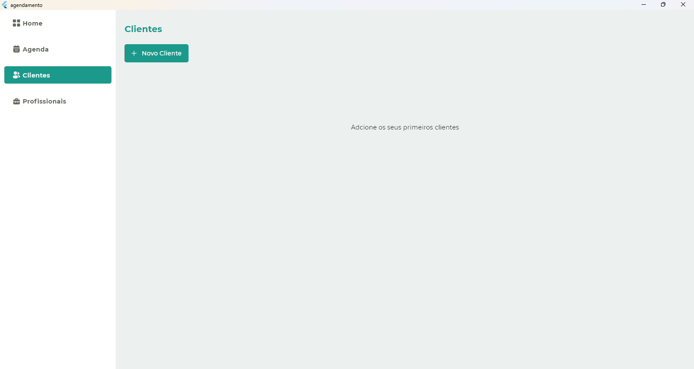
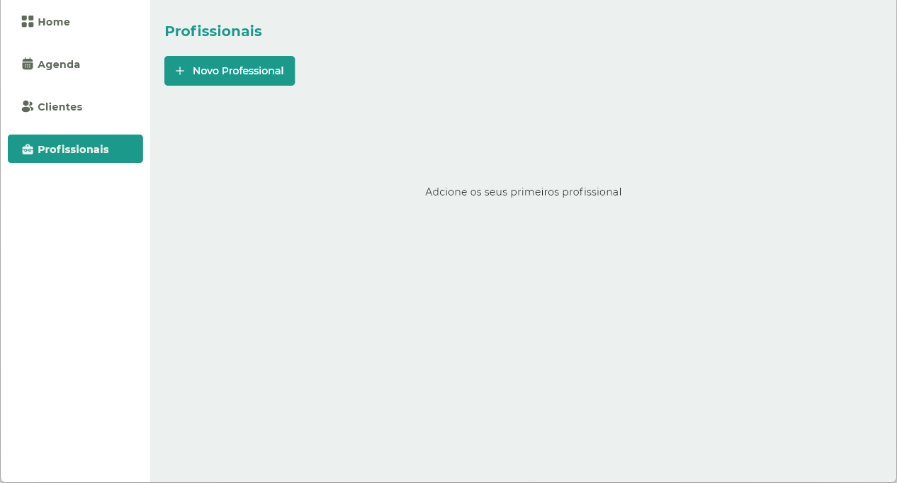

  <h1>Agendamento</h1>

<h4 align="center"> 
	🚧  App de Agendamento 🚀 Refactoring  🚧
</h4> <!-- Status -->

<h2 id="sumario">Tabela de conteúdos</h2>
<ul>
    <li><a href="#sobre">Sobre o Projeto</a></li>
    <li><a href="#funcionalidade">Funcionalidades</a></li>
    <li><a href="#screenshots">ScreenShots</a></li>
    <li><a href="#linguagem">Linguagens e Ferramentas</a></li>
    <li><a href="#started">Getting Started</a></li>
    <li><a href='#autor'>Autor</a></li>
    <!--<li><a href=#licenca>Licença</a></li>-->
</ul>
<!-- final sumario -->

<h2 id='sobre'>💻 Sobre o Projeto</h2>

Este aplicativo de agendamento foi criado para facilitar o agendamento de serviços.

<!--final sobre -->

<h2 id='funcionalidade'>⚙️ Funcionalidades</h2>

- [x] Cadastro de Profissionais;
- [x] Editar profissionais;
- [x] Deletar profissionais;
- [x] Cadastro de cliente
- [x] Editar cliente;
- [x] deletar cliente;
- [X] Agendamento de Serviços;

<!-- ScreenShots -->

<h2 id="screenshot">ScreenShots</h2>

 
  

    Cliente
  

  

 
  

    Profissional
  

  

<!-- final funcionalidades -->
<h2 id='linguagem'>🛠 Linguagens e Ferramentas</h2>

As seguintes ferramentas foram usadas na construção do projeto:

<ul>
  <li>
  </li>
  <li></li>
  <li></li>
  <li>Sembast</li>  
</ul>
<!-- final linguagens -->
<h2 id='started'>🚀 Getting Started</h2>

Para clonar e rodar essa aplicação, você precisa do [Git](https://git-scm.com) and [Flutter](https://docs.flutter.dev/get-started/install) instalados no seu computador. Digite os seguites comandos:

    - Baixe ou clone este repositório usando o link abaixo:
    $ git clone https://github.com/AdrianaBispo/agendamento.git
    
    - Vá para a raiz do projeto e execute o seguinte comando no console para obter as dependências necessárias:
    $ flutter pub get

<h2 id="autor">Autor</h2>

  
Feito por Adriana Bispo. Entre em contato

  

